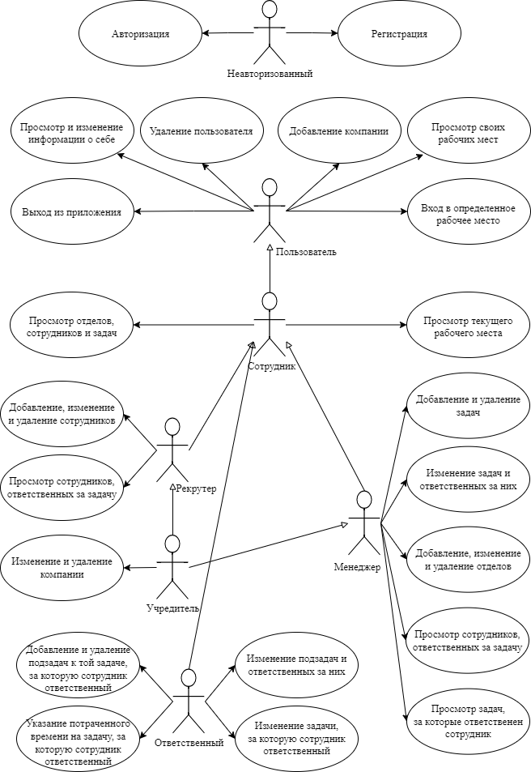
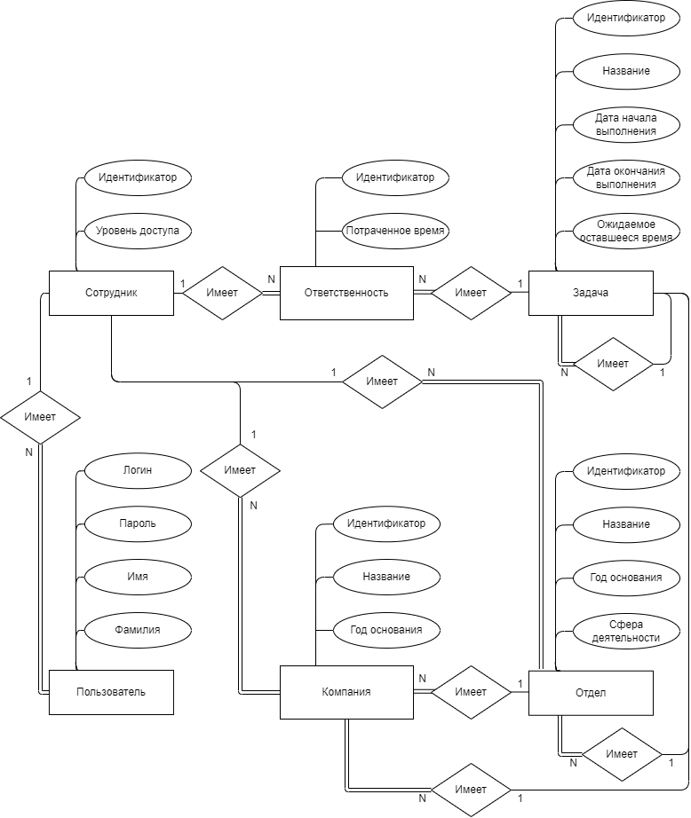
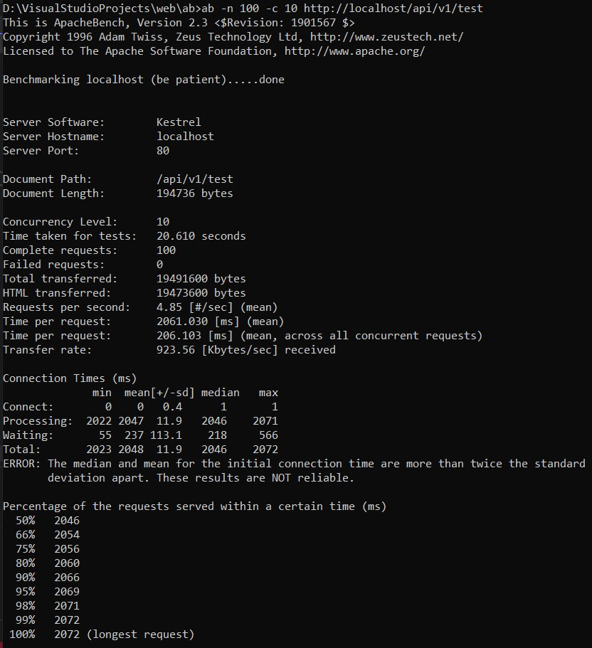
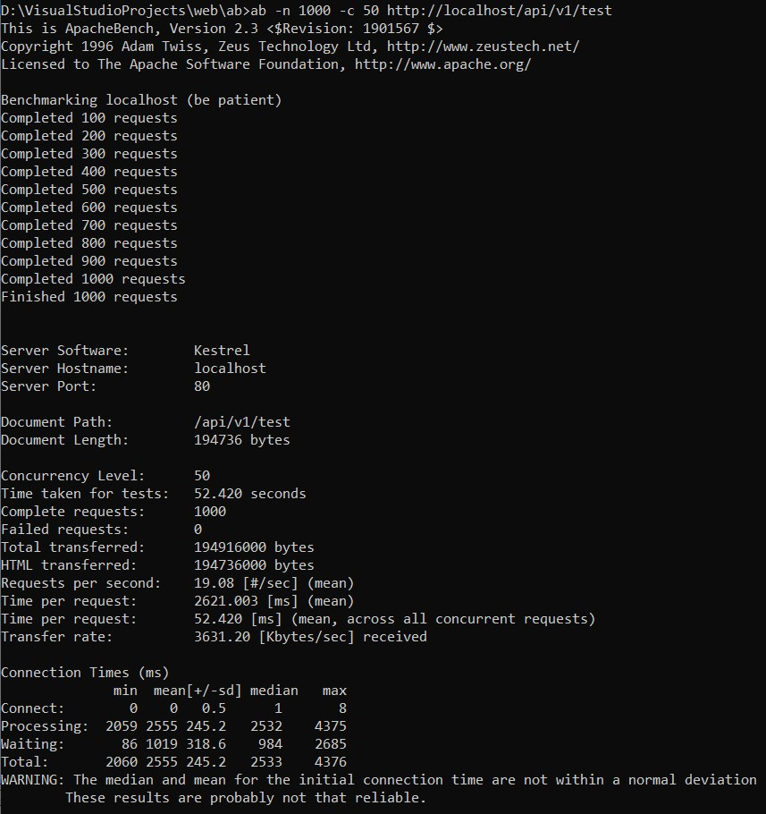
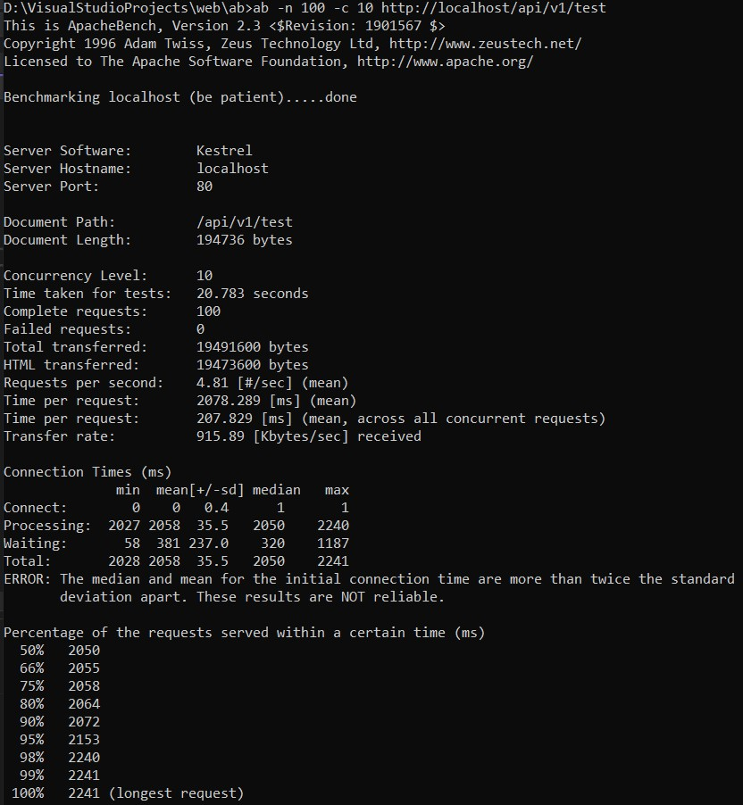
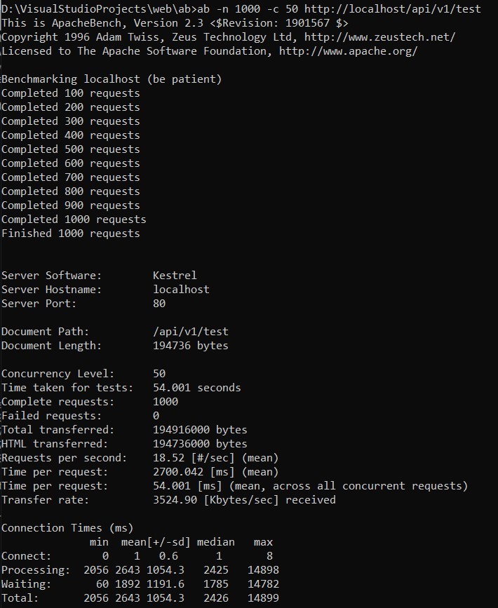

# Отслеживание проектов и задач компании

### Краткое описание идеи проекта

Необходимо реализовать БД, а также интерфейс для доступа к данным.

Данный проект дает возможность создавать проекты и задачи, 
назначать им сроки и ответственных за них сотрудников.  
Подобные системы планирования проектов позволяют грамотно распределить сотрудников по задачам, 
а также назначить сроки выполнения.

Есть роли: не авторизован, пользователь, сотрудник, HR, менеджер, учредитель, ответственный за задачу.

### Use-case диаграмма

### ER-диаграмма сущностей

### UML-диаграмма компонентов для всего приложения, с учетом полноценного GUI

### Результаты проверки балансировки

##### Без балансировки

##### С балансировкой

